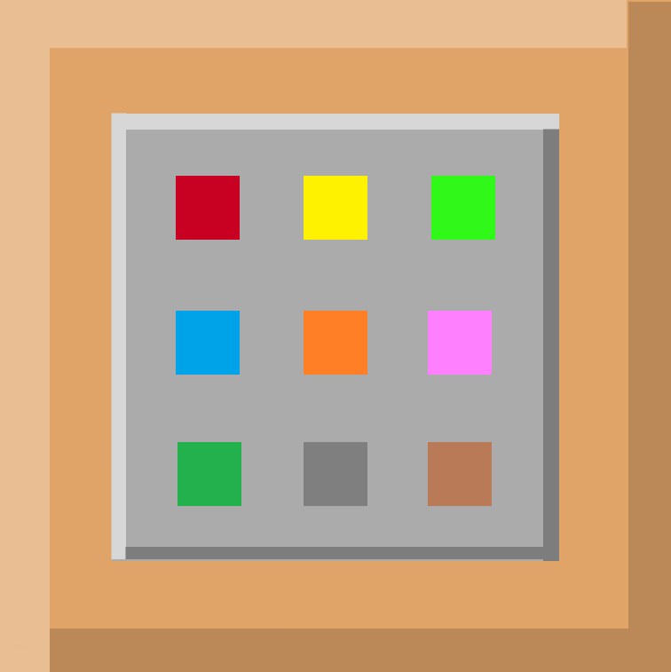

# BECBCT
- Bedrock Edition Command Block's Convenient Commands Import Tools

 
 
# Why we establish this project?
- It is very troublesome to set so many command blocks, and the opreation of .function file is inconvenience, so that we established this project.
# Some basic functions:
    void FourierSeriesBuilder(TrigonometricFunction TriFunc[],int n)
    //TrigonometricFunction is a struct in 'becbct.h'
